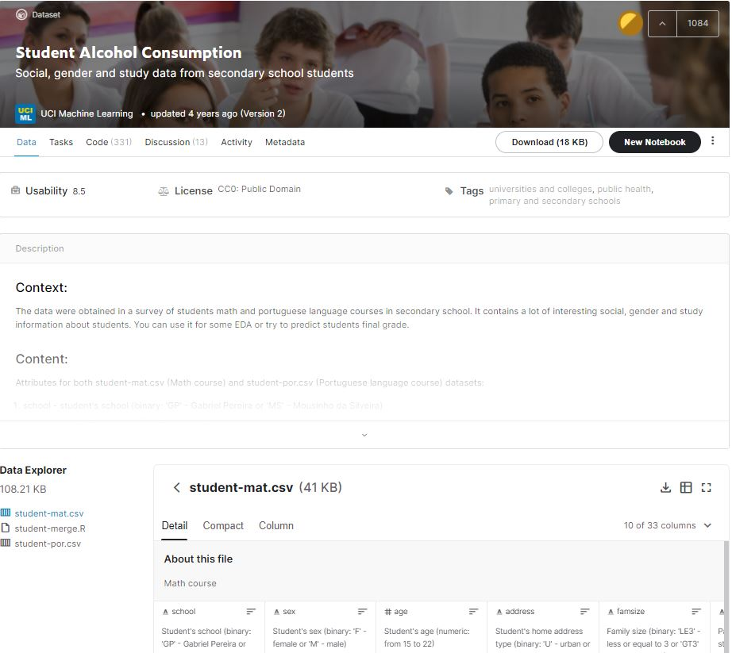
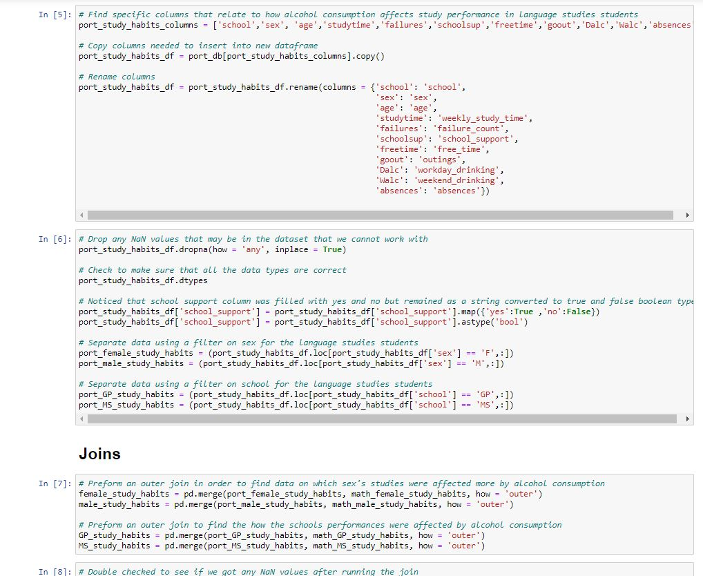
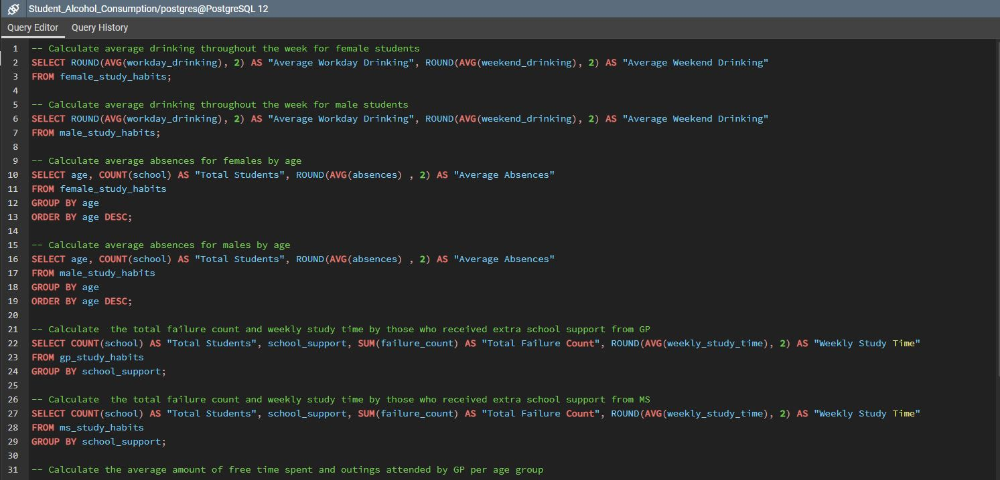

# Alcohol Consumption Study

PROJECT PROPOSAL

We wanted to observe how student alcohol consumption affected study habits. We used the dataset and transformed the dataset to specifically look at gender and school correlations. Observing specific columns, we reduced the amount of columns from 33 to 11 that would help us find correlations between student alcohol consumption and their study habits. We looked at whether or not gender, school, additional support, and age had an effect on time spent studying. Ultimately, we joined the datasets based on which school they attended, as well as gender to find affects within a joined dataset. The joined datasets were then loaded to SQL to further query the data for analysis.

EXTRACT

We sourced our dataset on Kaggle.com from UCI Machine Learning that looked at Student Alcohol Consumption surveying students in math and Portugese language courses in a secondary school (https://www.kaggle.com/uciml/student-alcohol-consumption). The original data was formatted as CSV files. After extracting the data and importing the CSV files into a jupyter notebook that housed both datasets, we used pandas as a dependecy to transform the data. 

TRANSFORM

From 33 columns that observed various social, gender, and study information, we transformed the data by creating a new dataframe using only specific columns (school’,‘sex’, ‘age’,‘studytime’,‘failures’,‘schoolsup’,‘freetime’,‘goout’,‘Dalc’,‘Walc’,‘absences’).

We renamed (school’,‘sex’, ‘age’,‘studytime’,‘failures’,‘schoolsup’,‘freetime’,‘goout’,‘Dalc’,‘Walc’, ‘absences’) to (‘school’,‘sex’,‘age’,‘weekly_study_time’,‘failure_count’,‘school_support’,‘free_time’,‘outings’,‘workday_drinking’,‘weekend_drinking’,‘absences’) to increase readability and accurately represent the dataset. We dropped NaN values and examined the datatypes of the 11 columns.

We recorded that the ‘school_support’ column for each field of study had a datatype object string, so we changed the datatype in ‘school_support’ to boolean values and converted the Yes or No values to return True or False statements. This would ultimately be used in our SQL query to observe the amount of failed courses from individuals who did or did not receive addtional support. 

By using the loc function, we were able to filter the data and return dataframes containing information for the entire ‘Female’ and ‘Male’ population for the datasets as well as dataframes containing information for students that attended either ‘GP’ and ‘MS’.

Outer merges were performed in order to find the data on which sex’s studies were affected more by alcohol consumption as well as how the individual schools performances were affected by alcohol consumption.

LOAD

Creating a connection string and engine in jupyter, we loaded all joined databases (female_study_habits, male_study_habits, GP_study_habits, MS_study_habits), into SQL

DATA ANALYSIS

In total, 8 queries were ran in order to show what kind of analysis can be performed in SQL based off of the tables that were loaded. The first two queries were used to calculate average drinking throughout the week for both sexes in order to see the differences between them. Then, we ran queries in order to calculate how drinking affected the average amount of absences for each sex based on their age group. Once we finished the queries to examine sexes, we then ran queries to calculate total failures based on weekly study time and extra school support received by schools. Finally, the last group of queries showed how much free time and outings the school’s population had by age group.

